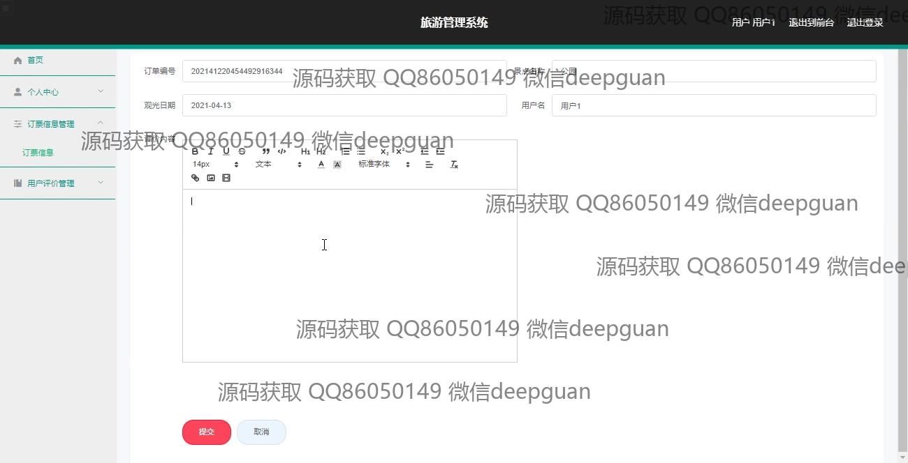

<h1 align="center">旅游管理系统的设计与实现</h1>

## 简介
旅游管理系统：角色分为管理员、用户；功能包括用户管理、景点信息管理、订单管理、用户评价管理、系统管理、支付方式选择和旅游路线编辑等模块，支持信息录入、更新和查询，以提升用户体验和管理效率。    --计算机毕业设计源码；毕设源码；java毕业设计源码

## 联系方式

<h3 align="center">获取完整代码与数据库文件 + 微信：deepguan QQ: 86050149 QQ群: 783742310</h3>

<h3 align="center">可帮忙远程部署 包运行成功！提供远程部署、修改代码、设计文档指导、代码讲解等服务！</h3>

## 功能介绍（完整见运行截图）
管理员：管理员在系统中具有全面的管理功能，包括用户管理、景点信息管理、订单管理和用户评价管理等模块，能够查看、编辑和删除系统中的数据。同时，管理员可以进行景点信息的添加、更新和删除，并为用户提供必要的服务保障。此外，管理员还负责处理用户的订单和评价，并确保景点信息的准确性和完整性。系统管理功能允许管理员管理系统配置和执行系统维护任务，确保系统平稳运行。管理员在系统的任何地方都可以通过导航栏快速切换不同模块，便于全面管理和高效操作。

用户：用户可以通过系统的登录界面输入账号和密码访问系统，注册新账户或选择身份类型以获得相应的访问权限。在系统中，用户可以查询和浏览旅游线路，查看景点详细信息和价格，并使用在线预订功能规划其旅游行程。在购物车中选择景点后，用户可以核对订单信息并选择适合的支付方式进行支付，确保顺利完成预订。此外，用户还可以管理个人信息和订单历史，提供对自己旅游安排的便利管理。用户个人中心则允许查看和更新个人资料，提高整体体验。

## 运行截图

本代码来源于网络,仅供学习参考使用!

